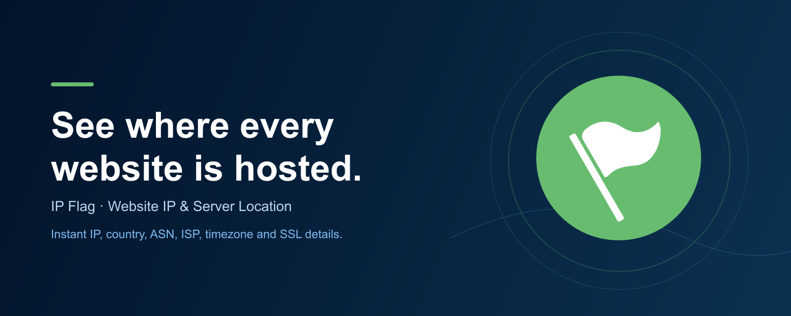
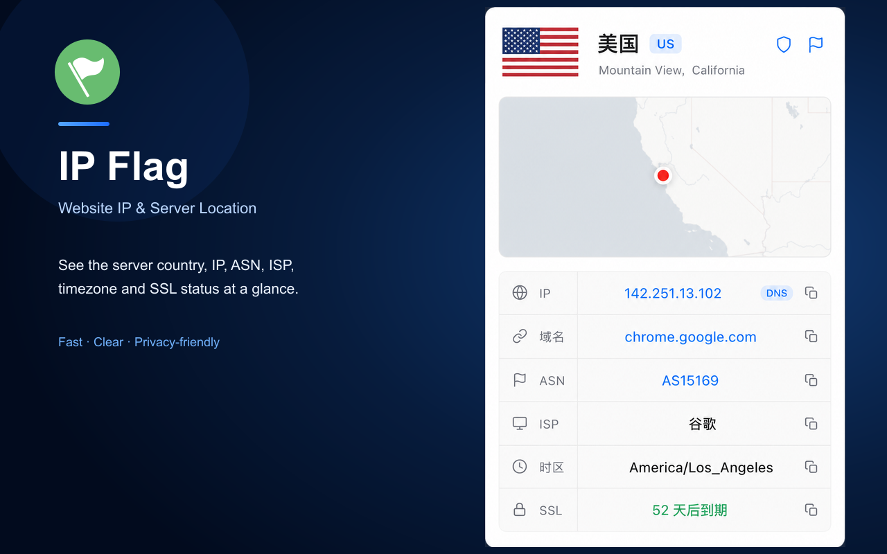

<div align="center">
  
  <h1>IP Flag</h1>
  <p><strong>See where every website is hosted.</strong></p>
  <p>Website IP, server country, ASN, ISP, timezone and SSL details—right from your browser toolbar.</p>
  <p>
    <a href="https://chromewebstore.google.com/detail/ipgeo-flag/aaclbfgifnkbhkokgajglhgphjjjcoaa">Chrome Web Store</a>
    · <a href="https://ipflag.io">Website</a>
    · <a href="https://api.ipflag.io/health">API health</a>
  </p>
</div>

<p align="center">
  
</p>

IP Flag is a Manifest V3 Chrome extension for understanding the infrastructure behind the websites you visit. It adds a country flag to the browser toolbar and opens a compact details card with the resolved server information.

## See it in action

<div align="center">
  
</div>

## What it shows

- Server country flag in the Chrome toolbar
- Hostname and resolved IP address
- ASN, ISP, city, region, timezone and coordinates
- SSL certificate expiry and certificate summary
- Optional map preview for the resolved location
- Square or rectangular flag display in the expanded card
- Light and dark mode support
- English and Simplified Chinese extension UI

## How it works

1. Open a website in Chrome.
2. IP Flag reads the active page's network metadata and hostname.
3. The hostname or IP is sent to the IP Flag API for geolocation.
4. Results are cached in session storage and shown in the toolbar and popup.

The extension does not read page content, form fields, cookies, passwords or request/response bodies.

## IP Flag API

The production API is a statically compiled Go service in [`api-go/`](api-go/). It exposes domain and IP lookups, with SSL certificate information included for domain requests:

```text
GET https://api.ipflag.io/domain/example.com
GET https://api.ipflag.io/ip/8.8.8.8
GET https://api.ipflag.io/domain?domain=example.com
GET https://api.ipflag.io/ip?ip=8.8.8.8
```

Example response:

```json
{
  "ip": "8.8.8.8",
  "country_code": "US",
  "country": "United States",
  "region": "California",
  "city": "Mountain View",
  "timezone": "America/Los_Angeles",
  "postal_code": "95196",
  "accuracy": "HIGH",
  "asn": "AS15169",
  "isp": "Google LLC",
  "latitude": 37.422,
  "longitude": -122.085,
  "is_datacenter": true,
  "datacenter": "Google LLC",
  "is_vpn": false,
  "is_proxy": false,
  "is_tor": false,
  "is_abuser": false,
  "abuser_score": "0.0016 (Low)"
}
```

Domain responses also include SSL check time, certificate validity, expiry time, remaining days, subject and issuer. The public response intentionally omits a provider/source field.

[ipapi.is](https://ipapi.is) is the primary geolocation source; the local DB-IP Lite databases stay installed as the fallback for when the upstream is unreachable or out of quota. Successful lookups are cached for 30 days across restarts. The `is_datacenter`/`is_vpn`/`is_proxy`/`is_tor`/`is_abuser`/`abuser_score`/`accuracy` fields come from ipapi.is only — when they are absent the value is unknown, not false. See [`api-go/README.md`](api-go/README.md).

## Install locally

1. Clone this repository.
2. Open `chrome://extensions` in Chrome.
3. Enable **Developer mode**.
4. Choose **Load unpacked**.
5. Select the repository directory.

The packaged extension uses the root `manifest.json`, `background.js`, `popup.html`, `popup.css`, `popup.js`, `icons/` and `flags/` files.

## Website and API development

The multilingual product website lives in [`website/`](website/). The site supports English, Simplified Chinese, Traditional Chinese, Japanese, German, Russian, French and Spanish.

```bash
cd website
npm install
npm run dev
```

Production checks:

```bash
npm run build
npm run lint
```

For the Go API:

```bash
cd api-go
go test ./...
go build ./...
```

## Repository layout

```text
background.js       Chrome service worker and toolbar flag updates
popup.html/js/css   Extension popup UI
flags/              Country flag assets
icons/              Browser and store icons
api-go/             Production Go API, deployment and DB update timer
website/            Multilingual product website
store-assets/       Chrome Web Store listing artwork
manifest.json       Chrome Extension Manifest V3
```

## Privacy and permissions

IP Flag sends the current website hostname or resolved IP to `api.ipflag.io` only to determine server location. Lookup results are cached in browser session storage and cleared when the session ends. The extension does not request your name, email, passwords, payment information or page content.

The public privacy policy is available at [ipflag.io/privacy](https://ipflag.io/privacy).

## Chrome Web Store assets

The latest listing artwork is available under [`store-assets/chrome-web-store/`](store-assets/chrome-web-store/):

| Asset | Size |
| --- | ---: |
| [`store-icon-128-ai.png`](store-assets/chrome-web-store/store-icon-128-ai.png) | 128 × 128 |
| [`screenshot-1280x800-ai.png`](store-assets/chrome-web-store/screenshot-1280x800-ai.png) | 1280 × 800 |
| [`small-promo-440x280-ai.png`](store-assets/chrome-web-store/small-promo-440x280-ai.png) | 440 × 280 |
| [`marquee-1400x560-ai.png`](store-assets/chrome-web-store/marquee-1400x560-ai.png) | 1400 × 560 |

## Links

- [IP Flag website](https://ipflag.io)
- [Chrome Web Store listing](https://chromewebstore.google.com/detail/ipgeo-flag/aaclbfgifnkbhkokgajglhgphjjjcoaa)
- [Privacy policy](https://ipflag.io/privacy)
- [API health check](https://api.ipflag.io/health)
- [GitHub repository](https://github.com/gentpan/ipflag)

## License

No open-source license has been declared yet. Unless a license is added, the project remains all rights reserved by the project owner.
